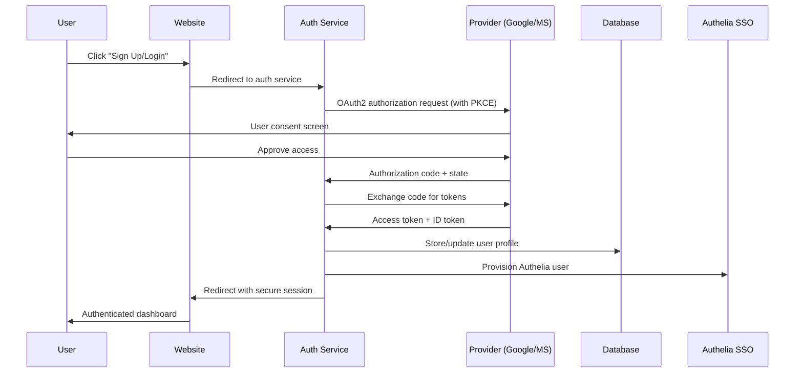

# DigiConsult User Authentication & CRM System - Project Plan

## 📋 **Executive Summary**

This project plan outlines the development of a modern user authentication system for DigiConsult, replacing the current "Client Portal" with a comprehensive "Sign Up/Login" system supporting OAuth2 (Google/Microsoft) and email registration, integrated with a PostgreSQL-based CRM system and Authelia SSO.

## 🏗️ **Current Infrastructure Analysis**

### **Existing Components:**
- **Website**: `index.html` with current "Client Portal" button → `https://auth.digiconsult.ca`
- **Authelia SSO**: Configured with file-based authentication (`/n8n/authelia/`)
- **PostgreSQL**: Available in n8n stack (`n8n-postgres`)
- **Services**: n8n, Ollama, Faster-Whisper, Qdrant requiring user access
- **Domain**: `digiconsult.ca` with SSL via Caddy

### **Current Authentication Flow:**
```
Website → "Client Portal" → auth.digiconsult.ca → Authelia (file-based)
```

## 🎯 **Project Objectives**

### **Primary Goals:**
1. **Replace** "Client Portal" with modern "Sign Up/Login" system
2. **Implement** OAuth2 authentication (Google, Microsoft, Email)
3. **Create** PostgreSQL-based CRM database with user profiles
4. **Integrate** with Authelia for SSO access to infrastructure tools
5. **Enable** lead generation and customer relationship management

### **Success Metrics:**
- 📈 **User Adoption**: 50+ registrations in first month
- ⚡ **Performance**: <2s authentication flow completion
- 🔒 **Security**: OAuth2 compliance with PKCE implementation
- 📊 **CRM Data**: Complete user profiles for lead generation
- 🎯 **Integration**: Seamless access to all DigiConsult tools

## 🔍 **Comprehensive Requirements Analysis**

### **Functional Requirements:**

#### **FR1: Authentication Interface**
- Replace "Client Portal" button with "Sign Up/Login" button
- Dynamic button text based on authentication state
- Responsive design matching current DigiConsult branding

#### **FR2: Multi-Provider Authentication**
- **Google OAuth2**: Full profile information retrieval
- **Microsoft OAuth2**: Organization integration capabilities
- **Email Registration**: Custom form with email verification

#### **FR3: User Data Capture**
- **Required Fields**: First name, last name, email, organization
- **Optional Fields**: Location, gender, age, phone, industry
- **CRM Fields**: Lead source, registration date, engagement tracking

#### **FR4: Database Integration**
- PostgreSQL-based CRM schema following industry best practices
- User profile storage with relationship mapping
- Audit logging for GDPR compliance

#### **FR5: SSO Integration**
- Automatic Authelia user provisioning
- Role-based access to infrastructure tools
- Session management and security policies

### **Non-Functional Requirements:**

#### **NFR1: Security**
- OAuth2 with PKCE implementation
- JWT token management with refresh rotation
- Data encryption at rest and in transit
- GDPR-compliant data handling

#### **NFR2: Performance**
- Sub-2 second authentication flow
- Database query optimization
- CDN integration for static assets

#### **NFR3: Scalability**
- Support for 1000+ concurrent users
- Horizontal scaling capabilities
- Load balancing considerations

#### **NFR4: Reliability**
- 99.9% uptime target
- Automated backup procedures
- Disaster recovery protocols

## 📊 **Modern Authentication Architecture (2025 Standards)**

### **OAuth2/OIDC Flow Design:**


### **Database Schema Design:**

#### **Users Table (Core CRM)**
```sql
CREATE TABLE users (
    user_id UUID PRIMARY KEY DEFAULT gen_random_uuid(),
    email VARCHAR(255) UNIQUE NOT NULL,
    first_name VARCHAR(100) NOT NULL,
    last_name VARCHAR(100) NOT NULL,
    organization VARCHAR(200),
    location VARCHAR(200),
    phone VARCHAR(20),
    gender VARCHAR(20),
    age_range VARCHAR(20),
    industry VARCHAR(100),
    
    -- Authentication details
    auth_provider VARCHAR(50) NOT NULL, -- 'google', 'microsoft', 'email'
    provider_user_id VARCHAR(255),
    email_verified BOOLEAN DEFAULT FALSE,
    
    -- CRM fields
    lead_source VARCHAR(100),
    registration_date TIMESTAMP DEFAULT NOW(),
    last_login TIMESTAMP,
    user_status VARCHAR(50) DEFAULT 'active',
    
    -- Metadata
    created_at TIMESTAMP DEFAULT NOW(),
    updated_at TIMESTAMP DEFAULT NOW()
);
```

#### **User Sessions Table**
```sql
CREATE TABLE user_sessions (
    session_id UUID PRIMARY KEY DEFAULT gen_random_uuid(),
    user_id UUID REFERENCES users(user_id) ON DELETE CASCADE,
    access_token_hash VARCHAR(255),
    refresh_token_hash VARCHAR(255),
    expires_at TIMESTAMP,
    created_at TIMESTAMP DEFAULT NOW(),
    ip_address INET,
    user_agent TEXT
);
```

#### **User Activities Table (CRM Tracking)**
```sql
CREATE TABLE user_activities (
    activity_id UUID PRIMARY KEY DEFAULT gen_random_uuid(),
    user_id UUID REFERENCES users(user_id) ON DELETE CASCADE,
    activity_type VARCHAR(100), -- 'login', 'tool_access', 'profile_update'
    activity_details JSONB,
    timestamp TIMESTAMP DEFAULT NOW(),
    ip_address INET
);
```

## 📝 **User Stories & Acceptance Criteria**

### **Epic 1: Authentication System Foundation**

#### **Story 1.1: Update Website Interface**
**As a** DigiConsult website visitor  
**I want** to see a "Sign Up/Login" button instead of "Client Portal"  
**So that** I understand I can create an account and access services  

**Acceptance Criteria:**
- ✅ "Client Portal" button is replaced with "Sign Up/Login"
- ✅ Button shows "Dashboard" when user is authenticated
- ✅ Button styling matches DigiConsult brand guidelines
- ✅ Mobile responsiveness maintained
- ✅ Loading states implemented for authentication process

#### **Story 1.2: Authentication Service Setup**
**As a** system administrator  
**I want** a secure authentication service  
**So that** users can register and login safely  

**Acceptance Criteria:**
- ✅ Node.js/Express authentication service deployed
- ✅ OAuth2 providers configured (Google, Microsoft)
- ✅ PKCE implementation for security
- ✅ JWT token management with refresh rotation
- ✅ Rate limiting and security headers implemented
- ✅ Comprehensive error handling and logging

### **Epic 2: OAuth2 Integration**

#### **Story 2.1: Google OAuth2 Registration**
**As a** new user  
**I want** to sign up using my Google account  
**So that** I can quickly access DigiConsult services without creating new credentials  

**Acceptance Criteria:**
- ✅ Google OAuth2 consent screen displays DigiConsult branding
- ✅ User profile data retrieved: name, email, profile picture
- ✅ Additional information form presented for CRM data
- ✅ Account creation completed within 30 seconds
- ✅ Automatic email verification through Google OAuth
- ✅ Privacy policy and terms acceptance integrated

#### **Story 2.2: Microsoft OAuth2 Registration**
**As a** business user  
**I want** to sign up using my Microsoft/Office 365 account  
**So that** I can leverage my existing business credentials  

**Acceptance Criteria:**
- ✅ Microsoft OAuth2 integration with organization detection
- ✅ Business email domain validation
- ✅ Company information pre-population when available
- ✅ Azure AD integration for enterprise accounts
- ✅ Tenant information captured for B2B analytics
- ✅ Role-based access consideration for enterprise users

#### **Story 2.3: Email Registration Flow**
**As a** user without Google/Microsoft accounts  
**I want** to register using my email address  
**So that** I can still access DigiConsult services  

**Acceptance Criteria:**
- ✅ Email registration form with all required CRM fields
- ✅ Password strength validation (12+ chars, complexity)
- ✅ Email verification with secure token (expires in 24h)
- ✅ Confirmation email with DigiConsult branding
- ✅ Account activation within email link click
- ✅ Resend verification option available

### **Epic 3: CRM Database Integration**

#### **Story 3.1: User Profile Management**
**As a** registered user  
**I want** to manage my profile information  
**So that** DigiConsult has accurate information for personalized service  

**Acceptance Criteria:**
- ✅ Profile dashboard showing all user information
- ✅ Edit capability for all non-authentication fields
- ✅ Real-time validation and error handling
- ✅ Audit trail for profile changes
- ✅ Data export capability (GDPR compliance)
- ✅ Account deletion option with confirmation

#### **Story 3.2: CRM Data Analytics**
**As a** DigiConsult business administrator  
**I want** to analyze user registration and engagement data  
**So that** I can improve lead generation and customer service  

**Acceptance Criteria:**
- ✅ Registration analytics dashboard
- ✅ User demographic reporting
- ✅ Lead source tracking and attribution
- ✅ Engagement metrics across services
- ✅ Export capabilities for marketing tools
- ✅ Privacy-compliant data aggregation

### **Epic 4: Authelia SSO Integration**

#### **Story 4.1: Automatic User Provisioning**
**As a** registered user  
**I want** to automatically get access to DigiConsult tools  
**So that** I don't need separate credentials for each service  

**Acceptance Criteria:**
- ✅ Authelia user creation upon successful registration
- ✅ Default "member" group assignment
- ✅ Password synchronization or token-based authentication
- ✅ User deactivation capability for administrators
- ✅ Group management integration
- ✅ Session synchronization between services

#### **Story 4.2: Service Access Control**
**As a** system administrator  
**I want** to control which services registered users can access  
**So that** I maintain security while providing appropriate access  

**Acceptance Criteria:**
- ✅ n8n: Member invitation system integration
- ✅ Ollama: Access control through Authelia groups
- ✅ Faster-Whisper: Member-level access enabled
- ✅ PostgreSQL: Admin-only access maintained
- ✅ Role-based access control documentation
- ✅ Access audit logging implemented

### **Epic 5: User Experience & Security**

#### **Story 5.1: Seamless Login Experience**
**As a** returning user  
**I want** a fast and seamless login experience  
**So that** I can quickly access the tools I need  

**Acceptance Criteria:**
- ✅ "Remember me" functionality with secure storage
- ✅ Social login buttons with provider branding
- ✅ Password reset flow for email users
- ✅ Account lockout protection after failed attempts
- ✅ Multi-factor authentication option available
- ✅ Session management with automatic renewal

#### **Story 5.2: Privacy and Data Protection**
**As a** registered user  
**I want** my personal data to be protected and manageable  
**So that** I feel confident using DigiConsult services  

**Acceptance Criteria:**
- ✅ GDPR-compliant privacy policy integrated
- ✅ Consent management for data processing
- ✅ Data portability and export features
- ✅ Right to be forgotten implementation
- ✅ Encryption at rest and in transit
- ✅ Regular security audits and updates

## 🛠️ **Technical Implementation Plan**

### **Phase 1: Foundation Setup (Week 1-2)**
- Create PostgreSQL CRM database schema
- Set up Node.js authentication service infrastructure  
- Configure OAuth2 providers (Google, Microsoft)
- Implement basic JWT token management

### **Phase 2: Authentication Integration (Week 3-4)**
- Develop OAuth2 flows with PKCE
- Create email registration and verification system
- Implement user session management
- Build user profile management interface

### **Phase 3: Website Integration (Week 5-6)**
- Update DigiConsult website with new authentication UI
- Implement responsive design and loading states
- Create user dashboard and profile management
- Integrate with existing website styling

### **Phase 4: Authelia Integration (Week 7-8)**
- Develop Authelia user provisioning system
- Configure service access control
- Implement session synchronization
- Set up role-based access management

### **Phase 5: CRM Analytics & Testing (Week 9-10)**
- Build CRM analytics dashboard
- Implement comprehensive testing suite
- Perform security testing and optimization
- Deploy to production environment

### **Phase 6: Launch & Optimization (Week 11-12)**
- Production deployment and monitoring
- User acceptance testing
- Performance optimization
- Documentation and training

## 🔒 **Security Implementation Plan**

### **OAuth2 Security Measures:**
- **PKCE Implementation**: Prevents authorization code interception
- **State Parameter**: Prevents CSRF attacks
- **Secure Token Storage**: HttpOnly, Secure, SameSite cookies
- **Token Rotation**: Regular refresh token rotation
- **Scope Minimization**: Request only necessary permissions

### **Database Security:**
- **Encryption**: AES-256 encryption for sensitive data
- **Access Control**: Role-based database permissions
- **Audit Logging**: All data access and modifications logged
- **Backup Security**: Encrypted backups with secure storage

### **Application Security:**
- **Input Validation**: Comprehensive sanitization and validation
- **Rate Limiting**: API endpoint protection
- **Security Headers**: HSTS, CSP, X-Frame-Options implementation
- **Vulnerability Scanning**: Regular security assessments

## 📊 **Success Metrics & KPIs**

### **Technical KPIs:**
- **Authentication Success Rate**: >99.5%
- **Page Load Time**: <2 seconds
- **Database Query Performance**: <100ms average
- **Uptime**: >99.9%

### **Business KPIs:**
- **User Registration Rate**: 50+ in first month
- **Conversion from Registration to Tool Usage**: >70%
- **User Engagement**: Average 3+ tool accesses per user
- **Lead Quality Score**: Improvement in CRM lead scoring

### **Security KPIs:**
- **Failed Authentication Attempts**: <1% of total attempts
- **Security Incidents**: Zero critical security issues
- **Compliance Score**: 100% GDPR compliance audit
- **Vulnerability Resolution**: <24 hours for critical issues

## 🚀 **Deployment Strategy**

### **Environment Progression:**
1. **Development**: Local testing and development
2. **Staging**: Production-like testing environment
3. **Production**: Live deployment with monitoring

### **Rollback Plan:**
- Database migration rollback scripts
- Previous authentication system preservation
- Blue-green deployment strategy
- Real-time monitoring and alerting

## 📈 **Future Enhancements**

### **Phase 2 Features:**
- Advanced user analytics and behavior tracking
- Integration with marketing automation tools
- Enhanced CRM features (lead scoring, automated workflows)
- Advanced security features (device trust, risk-based authentication)

### **Scalability Considerations:**
- Microservices architecture migration
- Horizontal scaling capabilities
- CDN integration for global performance
- Advanced caching strategies

## 🎯 **Acceptance Testing Checklist**

### **Functional Testing:**
- [ ] Google OAuth2 registration and login
- [ ] Microsoft OAuth2 registration and login  
- [ ] Email registration with verification
- [ ] Profile management and updates
- [ ] Authelia SSO integration
- [ ] Service access control
- [ ] CRM data capture and analytics
- [ ] Password reset functionality
- [ ] Session management and security

### **Security Testing:**
- [ ] OWASP Top 10 vulnerability assessment
- [ ] OAuth2 security flow validation
- [ ] Database injection testing
- [ ] Session hijacking prevention
- [ ] CSRF protection verification
- [ ] Data encryption validation

### **Performance Testing:**
- [ ] Load testing with 100+ concurrent users
- [ ] Database performance optimization
- [ ] Authentication flow speed validation
- [ ] Memory usage and optimization
- [ ] Network latency minimization

## 📝 **Risk Assessment & Mitigation**

### **High Risk Items:**
1. **OAuth2 Security Vulnerabilities**
   - *Mitigation*: Follow OAuth2 Security BCP, implement PKCE, regular security audits

2. **Database Performance Under Load**
   - *Mitigation*: Implement connection pooling, query optimization, monitoring

3. **Third-Party Service Dependencies**
   - *Mitigation*: Implement circuit breakers, fallback mechanisms, SLA monitoring

### **Medium Risk Items:**
1. **User Adoption Challenges**
   - *Mitigation*: Clear communication, user training, gradual rollout

2. **Integration Complexity**
   - *Mitigation*: Comprehensive testing, staged deployment, rollback procedures

## 📚 **Documentation Requirements**

### **Technical Documentation:**
- API documentation with OpenAPI specification
- Database schema documentation
- Security implementation guide
- Deployment and configuration manual

### **User Documentation:**
- User registration and login guide
- Profile management instructions
- Privacy policy and terms of service
- FAQ and troubleshooting guide

---

**Project Timeline**: 12 weeks  
**Total Effort**: 480 hours (2 full-time developers)  
**Budget Consideration**: Development, testing, security audit costs  
**Success Definition**: Seamless user authentication with CRM integration driving lead generation and improved customer experience

This comprehensive project plan ensures DigiConsult implements a modern, secure, and scalable user authentication system that meets 2025 industry standards while driving business growth through effective CRM integration.